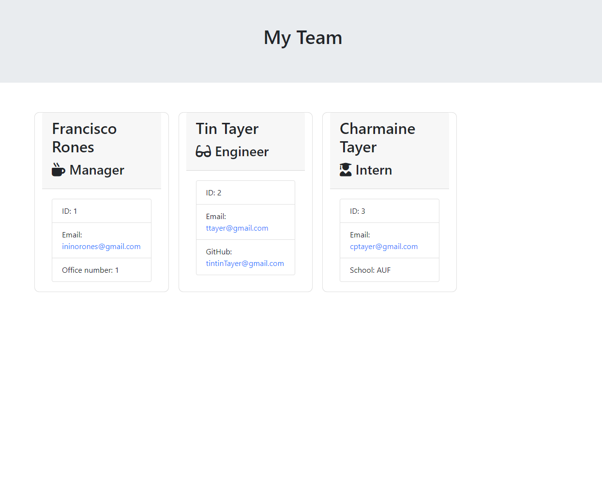

# Employee Template

### Descritption

This project generates your own work team circle from a manager, engineer and an intern on your team. Manager requires office number, Engineer requires github profile name, and intern requires current school you're attending to then renders all the input to an HTML file under output folder.

### Installation

required installation
inquirer and jest for testing

### Usage

This project is to test appending user input from node.js to the front end creating HTML file that shows the input from the user

### Table of Contents

  [Description](###Descritption)

  [Installation](###Installation)

  [Usage](###Usage)

  [License](###License)

  [Contributing](###Contributions)

  [Tests](###Tests)

### License

License under [MIT License](License)

### Contributions

None

### Tests

npm run test

### Questions and Suggestions

Feel free to check out my Github:

[github.com/francisN21](https://github.com/francisN21)

You can reach out to me for questions and suggestions at ininorones@gmail.com
